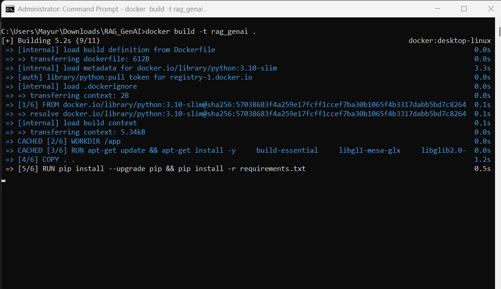
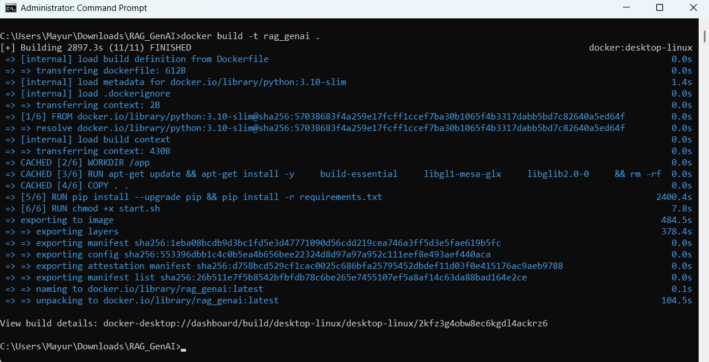
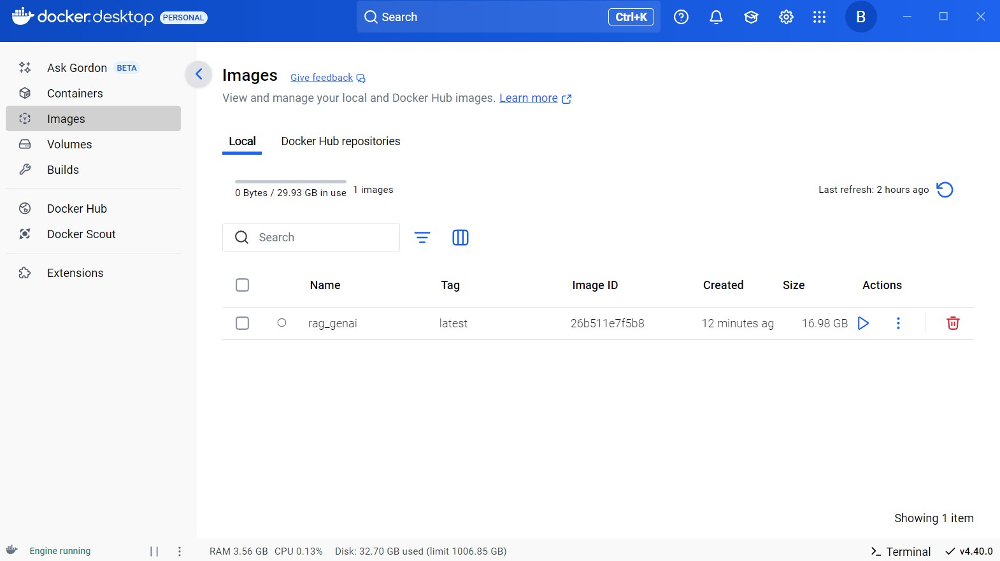
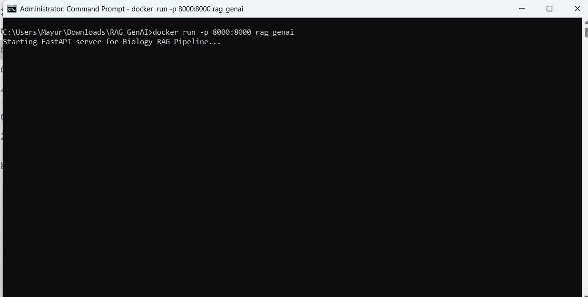
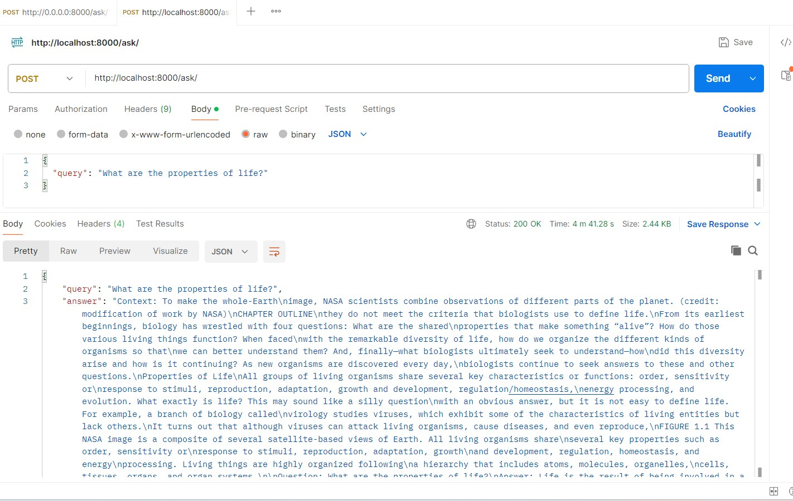

# 📘 RAG_GenAI: Retrieval-Augmented Generation for Biology Q&A

Colab URL: https://colab.research.google.com/drive/1ujdV17M1dYzjxlXefNGzZBeEFrLlv1o3?usp=sharing

**RAG_GenAI** is a Retrieval-Augmented Generation (RAG) pipeline designed to answer biology-related questions by leveraging content from the OpenStax Concepts of Biology textbook. It integrates PDF parsing, semantic chunking, vector embedding, FAISS-based similarity search, and text generation using Hugging Face Transformers, all served through a FastAPI backend.

# 🚀 Features
* PDF Parsing: Extracts and processes specific chapters from the OpenStax Concepts of Biology textbook.

* Semantic Chunking: Divides text into meaningful chunks for efficient embedding.

* Vector Embedding: Utilizes SentenceTransformers to generate embeddings for each chunk.

* Similarity Search: Implements FAISS to retrieve contextually relevant chunks based on user queries.

* Text Generation: Employs Hugging Face's gpt2 model to generate answers using retrieved contexts.

* API Interface: Exposes a /ask/ endpoint via FastAPI for seamless integration.

🧱 Architecture

```text
+---------------------+
|   User Query Input  |
+----------+----------+
           |
           v
+----------+----------+
|  FastAPI /ask/ API  |
+----------+----------+
           |
           v
+----------+----------+
|   generate_answer() |
+----------+----------+
           |
           v
+----------+----------+
|  search_similar()   |
+----------+----------+
           |
           v
+----------+----------+
|   FAISS Index       |
+----------+----------+
           |
           v
+----------+----------+
| SentenceTransformer |
+----------+----------+
           |
           v
+----------+----------+
|   GPT-2 Text Gen    |
+---------------------+

```

🛠️ Setup Instructions
**Prerequisites**
* Docker installed on your system.

* Internet connection to download necessary models and packages.

**Steps**

1. Clone the Repository
```bash
git clone https://github.com/RAG_GenAI/RAG_GenAI.git
cd RAG_GenAI
```

2. Build the Docker Image

```bash
docker build -t rag_genai .
```







3. Run the Docker Container

```bash
docker run -p 8000:8000 rag_genai
```


The API will be accessible at http://localhost:8000/ask/.

📬 API Usage
**Endpoint**

* POST /ask/

**Request Body**

```json
{
  "query": "What are the properties of life?"
}
```

**Response**

```json
{
  "query": "What are the properties of life?",
  "answer": "The properties of life include order, reproduction, adaptation, growth and development, regulation, homeostasis, and energy processing."
}
```



## 📄 Code Documentation

### main.py

```python
from fastapi import FastAPI
from pydantic import BaseModel
from rag_pipeline import generate_answer

app = FastAPI()

class QueryRequest(BaseModel):
    query: str

class QueryResponse(BaseModel):
    query: str
    answer: str

@app.post("/ask/", response_model=QueryResponse)
def ask_question(payload: QueryRequest):
    """
    Handles POST requests to /ask/ endpoint.
    Returns the generated answer for the provided query.
    """
    answer = generate_answer(payload.query)
    return QueryResponse(query=payload.query, answer=answer)
```

### rag_pipeline.py

```python
def generate_answer(query):
    """
    Generates an answer for the given query by:
    1. Retrieving relevant text chunks using FAISS.
    2. Concatenating the context.
    3. Generating a response using GPT-2 model.
    """
    context = " ".join(search_similar(query))
    prompt = f"Context: {context}\n\nQuestion: {query}\nAnswer:"
    response = llm(prompt, max_new_tokens=100, do_sample=True)
    return response[0]['generated_text']
```


📌 Assumptions
* Chapter Selection: Only chapters 5 to 54 from the OpenStax Concepts of Biology textbook are considered.

* Model Choice: all-MiniLM-L6-v2 is used for embeddings, and gpt2 is used for text generation.

* Chunk Size: Text is chunked into segments of approximately 250 tokens.

* Top-K Retrieval: The top 3 most similar chunks are retrieved for context.


🐞 Known Issues & Future Enhancements
* Limited Contextual Understanding: The current model may not capture complex biological concepts accurately.

  * Future Work: Integrate more advanced models like bert-base-uncased or domain-specific models.

* Static PDF Source: The system relies on a static PDF file.

  * Future Work: Implement dynamic document ingestion capabilities.

* No Authentication: The API lacks authentication mechanisms.

  * Future Work: Add API key-based authentication for secure access.

* Scalability: The current setup may not handle high traffic efficiently.

  * Future Work: Deploy using scalable services like AWS Lambda or Kubernetes.
 
